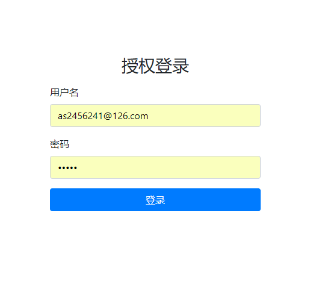
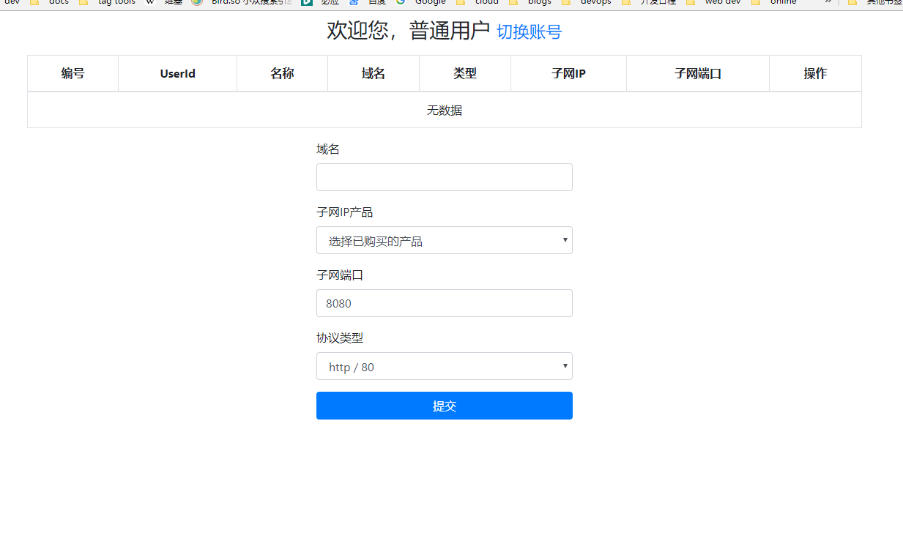
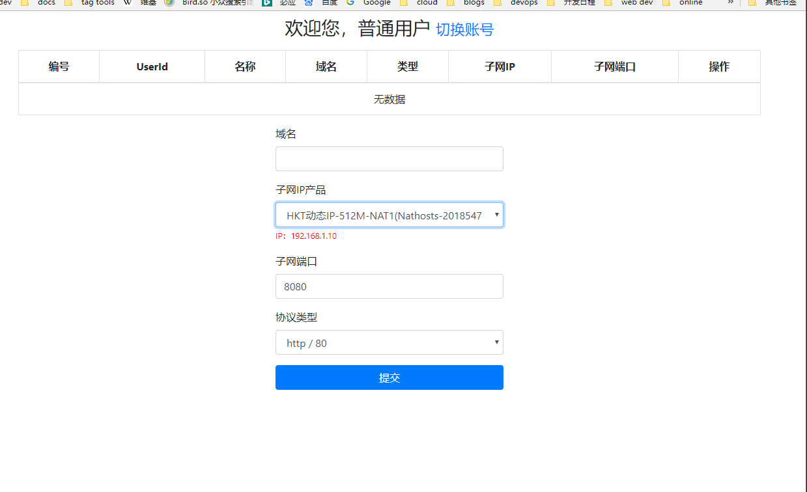
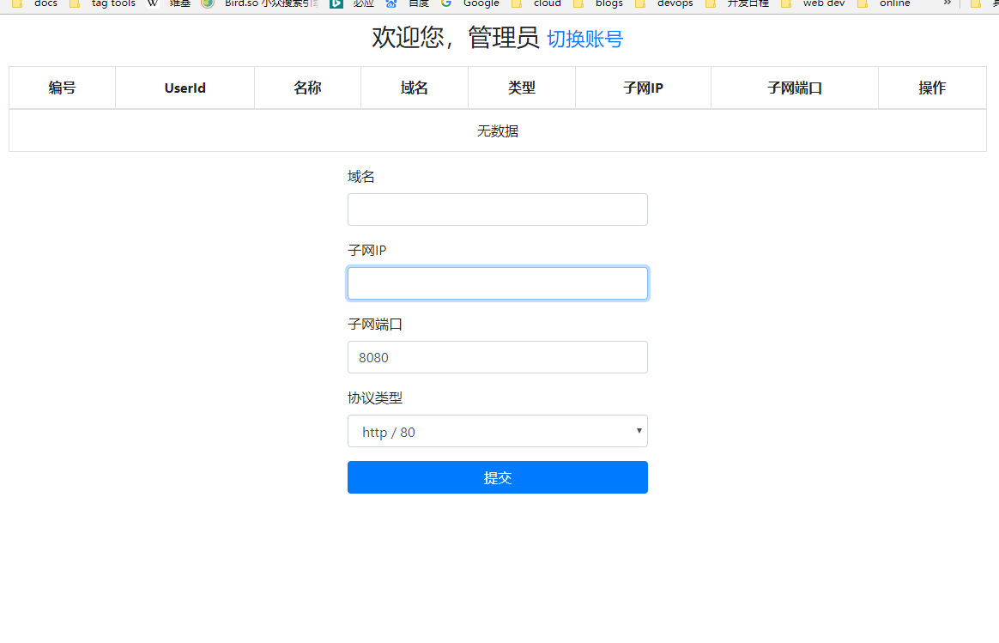
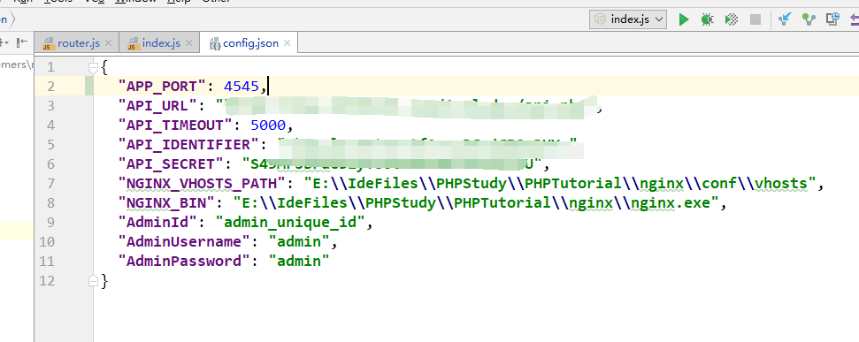

## README
一个实现对接whmcs管理用户产品实现Nginx反向代理操作工具


https://developers.whmcs.com/api-reference/getclientsproducts/


## Usage
复制默认配置文件
```
cp config.example.json config.json
```

## ScreenShots






## dependencies
